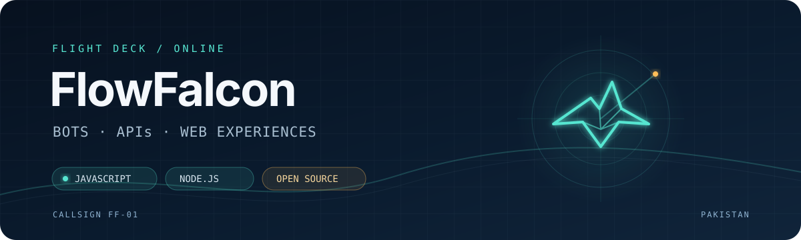

<!-- markdownlint-disable MD013 MD033 MD041 -->

<p align="center">
  
</p>

<p align="center">
  <a href="https://github.com/FlowFalcon?tab=followers"></a>
  <a href="https://github.com/FlowFalcon?tab=repositories"></a>
</p>

## `flight log`

I'm **Fathur**, an open-source builder focused on JavaScript projects that people can run, remix, and learn from.

My work usually lands in three places:

```text
bots/       modular automation across Telegram, WhatsApp, and Discord
web/        responsive interfaces built with the browser's native stack
tooling/    practical APIs and agent skills with honest documentation
```

## `selected missions`

### [telegram-bot-base](https://github.com/FlowFalcon/telegram-bot-base)

A modular [Telegraf.js](https://telegraf.js.org/) foundation with auto-loaded commands, middleware, logging, and bot mirroring.

### [Lilith-Bot-s](https://github.com/FlowFalcon/Lilith-Bot-s)

One Node.js bot core for **WhatsApp, Telegram, and Discord**, organized around a plugin system with hot reload.

### [Modern-LinkTree](https://github.com/FlowFalcon/Modern-LinkTree)

A framework-free Linktree alternative with a music player and JSON-driven customization.

### [ModernShop](https://github.com/FlowFalcon/ModernShop)

A responsive storefront template powered by plain HTML, CSS, JavaScript, and editable JSON data.

### [stop-coding-slop](https://github.com/FlowFalcon/stop-coding-slop)

An Agent Skill that keeps AI-assisted code focused, repository-native, proportional, and honest.

## `cockpit`

<p>
  
  
  
  
  
  
</p>

```js
const build = {
  default: "simple enough to understand",
  architecture: "modular where it helps",
  documentation: "verified before published",
  license: "open source"
};
```

## `open channel`

- Browse the full project hangar in **[my repositories](https://github.com/FlowFalcon?tab=repositories)**.
- Try the Telegram project preview at **[@flowfalcon_project_bot](https://t.me/flowfalcon_project_bot)**.
- Found something useful? Open an issue, send a focused pull request, or build your own version.

<p align="center">
  <sub>Designed as a flight deck, built from real repository signals.</sub>
</p>
